<h2>TensorFlow-FlexUNet-Image-Segmentation-Synthetic-NEU-Steel-Surface-Defect  (2026/01/14)</h2>
Toshiyuki Arai 
Software Laboratory antillia.com  
This is the first experiment of Image Segmentation for <b>Synthetic-NEU-Steel-Surface-Defect</b> based on our <a href="./src/TensorFlowFlexUNet.py">TensorFlowFlexUNet</a> 
(TensorFlow Flexible UNet Image Segmentation Model for Multiclass) , 
and <b>Synthetic-NEU-Seg</b> dataset with colorized masks, which was derived by us from   
<a href="https://opendatasets.vicomtech.org/di11-synthetic-neu-seg-images-via-stable-diffusion/33e9a1ec">
Synthetic NEU-Seg Images via Stable Diffusion</a>
  

<b>Actual Image Segmentation for Synthetic-NEU-Steel-Surface-Defect Images of 224x224 pixels</b> 
As shown below, the inferred masks predicted by our segmentation model trained by the dataset appear similar to the ground truth masks.
 
<b>rgb_map={Patches:blue, Inclusion:green,  Scratches:red}</b>  
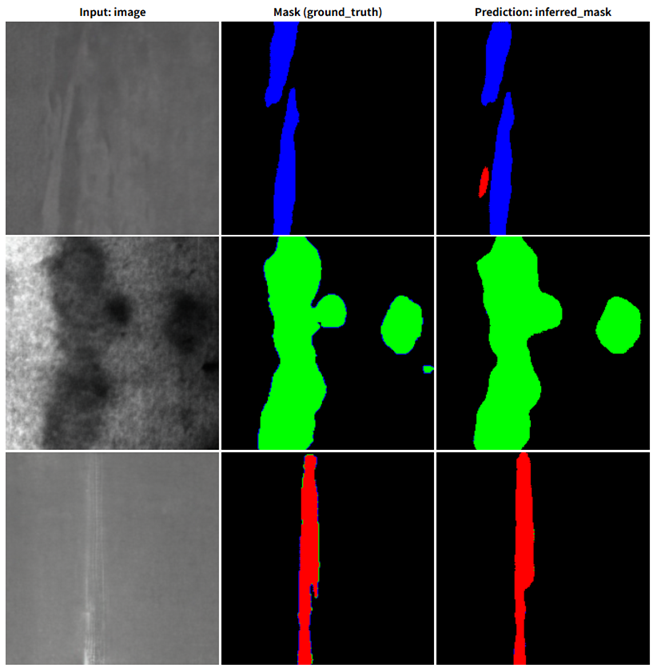 

 
<h3>1  Dataset Citation</h3>
The dataset used here was derived from   
<b>Synthetic_NEU-Seg_Images</b> dataset, which can be provided by your request  through the following web site  
<a href="https://opendatasets.vicomtech.org/di11-synthetic-neu-seg-images-via-stable-diffusion/33e9a1ec">
Synthetic NEU-Seg Images via Stable Diffusion</a>
  
Please refer to: <a href="https://pmc.ncbi.nlm.nih.gov/articles/PMC11436218/">
<b>Latent Diffusion Models to Enhance the Performance of Visual Defect Segmentation Networks in Steel Surface Inspection</b></a>
  
The following explanation was taken from <a href="https://github.com/Vicomtech/synthetic-neu-seg-images-via-stable-diffusion">
Synthetic NEU-Seg Images via Stable Diffusion</a>  
<b>Usage</b> 
The dataset is organized in the same way as the original NEU-seg dataset: the images folder contains the synthetic images of the defects, 
and the annotations folder contains the pixel-level annotations of each.  
The class values of the pixels in the masks are assigned as follows:  
<b>0. Background</b>,  
<b>1. Patches</b>,  
<b>2. Inclusion</b>,  
<b>3. Scratches</b>.  
Each image/annotation filename is self-descriptive, with regards to the class it belongs to.
  
<b>Authors</b> 
The following researchers have collaborated in the dataset creation and curation process: 
<ul>
<li>Jon Leiñena Otamendi</li>
<li>Fátima Saiz Álvaro</li>
</ul>
 
<b>Citation</b>
<pre>
@Article{s24186016,
  AUTHOR = {Leiñena, Jon and Saiz, Fátima A. and Barandiaran, Iñigo},
  TITLE = {Latent Diffusion Models to Enhance the Performance of Visual Defect Segmentation Networks in Steel Surface Inspection},
  JOURNAL = {Sensors},
  VOLUME = {24},
  YEAR = {2024},
  NUMBER = {18},
  ARTICLE-NUMBER = {6016},
  URL = {https://www.mdpi.com/1424-8220/24/18/6016},
  ISSN = {1424-8220},
  ABSTRACT = {This paper explores the use of state-of-the-art latent diffusion models, specifically stable diffusion, 
  to generate synthetic images for improving the robustness of visual defect segmentation in manufacturing components. 
  Given the scarcity and imbalance of real-world defect data, synthetic data generation offers a promising solution for 
  training deep learning models. We fine-tuned stable diffusion using the LoRA technique on the NEU-seg dataset and 
  evaluated the impact of different ratios of synthetic to real images on the training set of DeepLabV3+ and FPN segmentation models. 
  Our results demonstrated a significant improvement in mean Intersection over Union (mIoU) when the training dataset was 
  augmented with synthetic images. This study highlights the potential of diffusion models for enhancing the quality and diversity 
  of training data in industrial defect detection, leading to more accurate and reliable segmentation results. 
  The proposed approach achieved improvements of 5.95% and 6.85% in mIoU of defect segmentation on each model over the original dataset.},
  DOI = {10.3390/s24186016}
}
</pre>
 
<b>License</b> 
All datasets on this page are copyrigh by Vicomtech and published under the 
<b>Creative Commons Attribution-NonCommercial-NoDerivatives 4.0 License</b>.   
This means that you must attribute the work in the manner specified by the authors, 
you may not use this work for commercial purposes and if you remix, transform, or  
build upon the material, you may not distribute the modified material. 
 
<h3>
2 Synthetic-NEU-Seg ImageMask Dataset
</h3>
 If you would like to train this Synthetic-NEU-Seg Segmentation model by yourself,
please download the master  dataset from
<a href="https://opendatasets.vicomtech.org/di11-synthetic-neu-seg-images-via-stable-diffusion/33e9a1ec">
Synthetic NEU-Seg Images via Stable Diffusion</a>
 
We used the following 2 Python scripts to generate the Synthetic-NEU-Seg with colorized masks  from the original dataset. 
<ul>
<li><a href="./generator/ImageMaskDatasetGenerator.py">ImageMaskDatasetGenerator.py</a></li>
<li><a href="./generator/split_master.py">split_master.py</a></li>
</ul>
 Please put the generated dataset under <b>./dataset</b> folder to be:
<pre>
./dataset
└─Synthetic-NEU-Seg
    ├─test
    │   ├─images
    │   └─masks
    ├─train
    │   ├─images
    │   └─masks
    └─valid
        ├─images
        └─masks
</pre>
 
<b>You may not redistribute this dataset with colorized mask, and the commerical use of the dataset is prohibited.</b>  
As shown below, the number of images of train and valid datasets is large enough to use for a training set of our segmentation model.
<b>Synthetic-NEU-Seg Statistics</b> 
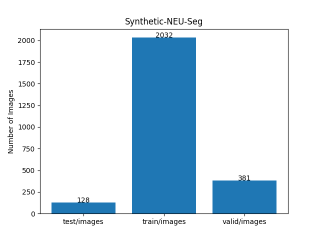 
 
  
<b>Train_images_sample</b> 
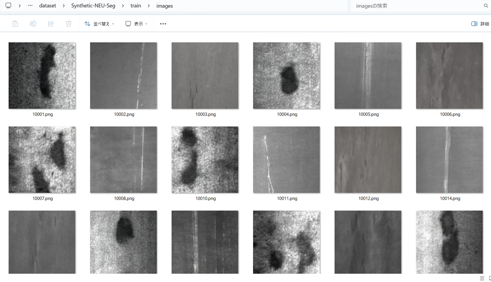
 
<b>Train_masks_sample</b> 
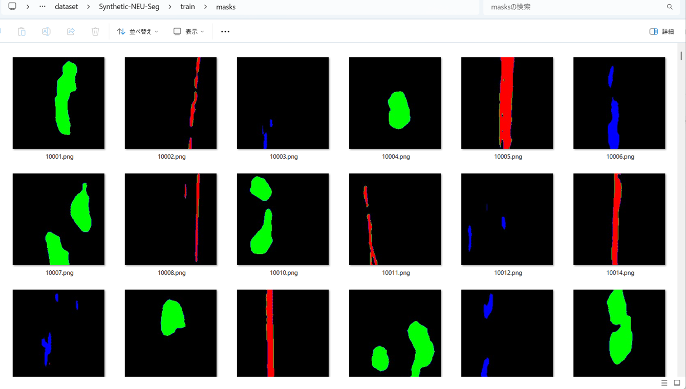
 
<h3>
3 Train TensorflowFlexUNet Model
</h3>
 We trained Synthetic-NEU-Seg TensorflowFlexUNet Model by using the following
<a href="./projects/TensorFlowFlexUNet/Synthetic-NEU-Seg/train_eval_infer.config"> <b>train_eval_infer.config</b></a> file.  
Please move to ./projects/TensorFlowFlexUNet/Synthetic-NEU-Seg and run the following bat file. 
<pre>
>1.train.bat
</pre>
, which simply runs the following command. 
<pre>
>python ../../../src/TensorFlowFlexUNetTrainer.py ./train_eval_infer.config
</pre>

<b>Model parameters</b> 
Defined a small <b>base_filters=16</b> and a large <b>base_kernels=(9,9)</b> for the first Conv Layer of Encoder Block of 
<a href="./src/TensorFlowFlexUNet.py">TensorFlowFlexUNet.py</a> 
and a large num_layers (including a bridge between Encoder and Decoder Blocks).
<pre>
[model]
image_width    = 256
image_height   = 256
image_channels = 3
input_normalize = True
normalization  = False

num_classes    = 4

base_filters   = 16
base_kernels  = (9,9)
num_layers    = 8

dropout_rate   = 0.03
dilation       = (1,1)
</pre>

<b>Learning rate</b> 
Defined a small learning rate.  
<pre>
[model]
learning_rate  = 0.00006
</pre>

<b>Loss and metrics functions</b> 
Specified "categorical_crossentropy" and "dice_coef_multiclass". 
<pre>
[model]
loss           = "categorical_crossentropy"
metrics        = ["dice_coef_multiclass"]
</pre>
<b >Learning rate reducer callback</b> 
Enabled learing_rate_reducer callback, and a small reducer_patience.
<pre> 
[train]
learning_rate_reducer = True
reducer_factor     = 0.4
reducer_patience   = 4
</pre>
<b>Early stopping callback</b> 
Enabled early stopping callback with patience parameter.
<pre>
[train]
patience      = 10
</pre>
<b></b> 
<b>RGB color map</b> 
rgb color map dict for Synthetic-NEU-Seg 1+1 classes. 
<pre>
[mask]
mask_file_format = ".png"
;Synthetic-NEU-Seg 1+3
;                  Patches:blue, Inclusion:green,  Scratches:red
rgb_map = {(0,0,0):0, (0,0,255):1, (0,255,0):2, (255,0,0):3,]
    
 
</pre>
<b>Epoch change inference callbacks</b> 
Enabled epoch_change_infer callback. 
<pre>
[train]
epoch_change_infer       = True
epoch_change_infer_dir   =  "./epoch_change_infer"
epoch_changeinfer        = False
epoch_changeinfer_dir    = "./epoch_changeinfer"
num_infer_images         = 6
</pre>
By using this epoch_change_infer callback, on every epoch_change, the inference procedure can be called
 for 6 images in <b>mini_test</b> folder. This will help you confirm how the predicted mask changes 
 at each epoch during your training process.    
<b>Epoch_change_inference output at starting (1,2,3)</b> 
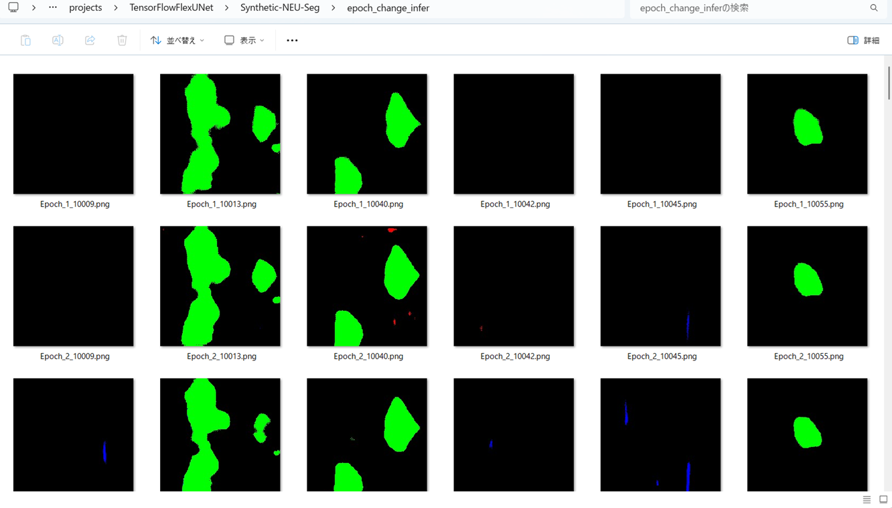 
 
<b>Epoch_change_inference output at ending (16,17,18)</b> 
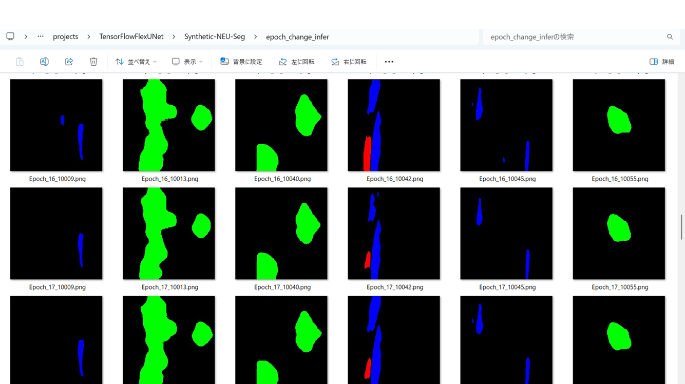 
 
<b>Epoch_change_inference output at ending (33,34,35)</b> 
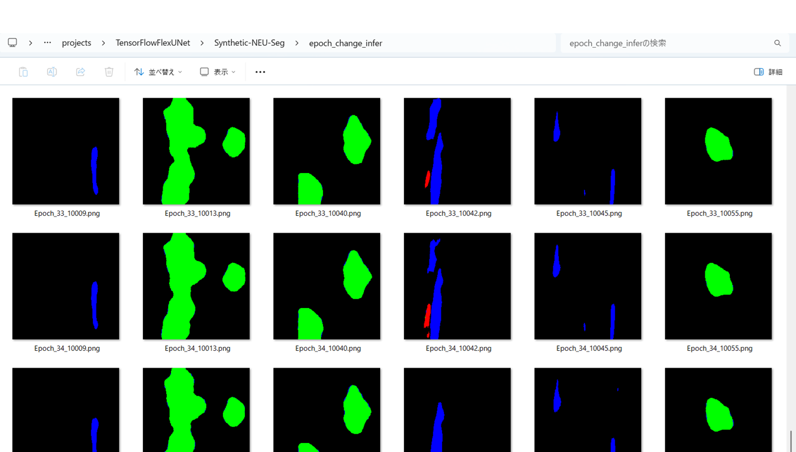 

 
In this experiment, the training process was stopped at epoch 35 by EarlyStoppingCallback.  
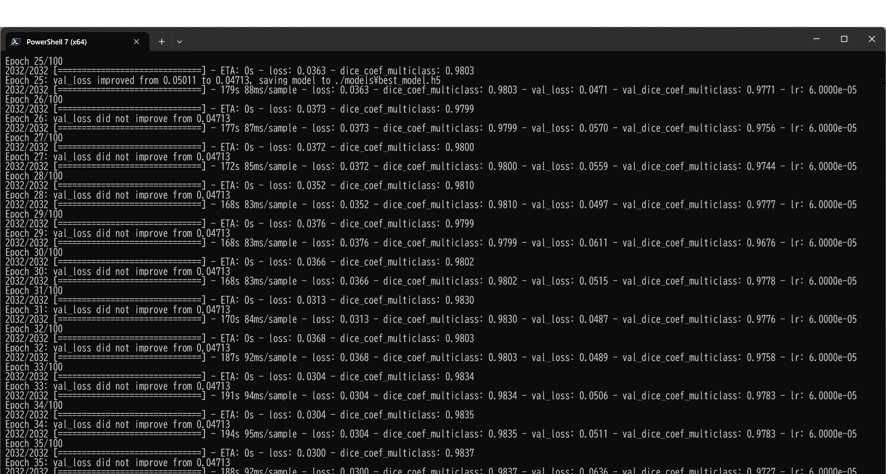 
 
<a href="./projects/TensorFlowFlexUNet/Synthetic-NEU-Seg/eval/train_metrics.csv">train_metrics.csv</a> 
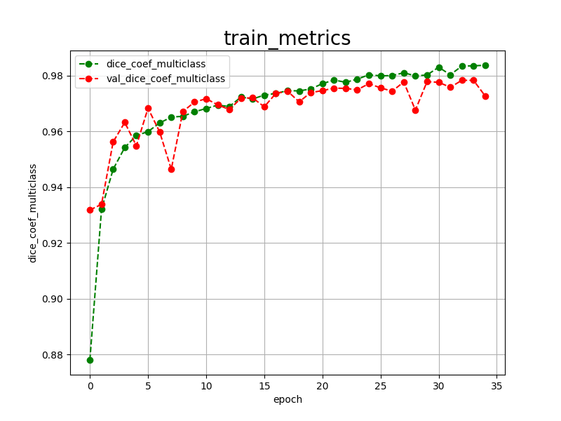 

 
<a href="./projects/TensorFlowFlexUNet/Synthetic-NEU-Seg/eval/train_losses.csv">train_losses.csv</a> 
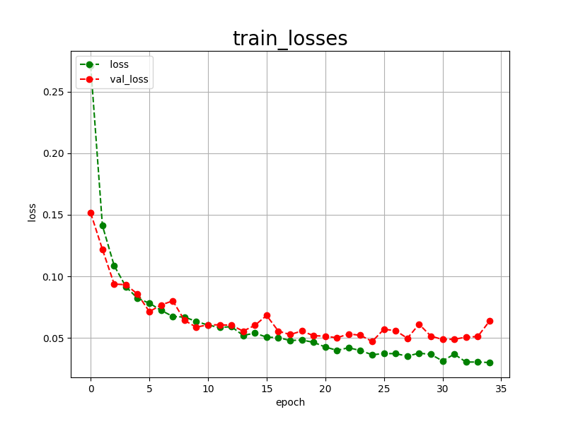 
 
<h3>
4 Evaluation
</h3>
Please move to a <b>./projects/TensorFlowFlexUNet/Synthetic-NEU-Seg</b> folder, 
and run the following bat file to evaluate TensorflowFlexUNet model for Synthetic-NEU-Seg. 
<pre>
>./2.evaluate.bat
</pre>
This bat file simply runs the following command.
<pre>
>python ../../../src/TensorFlowFlexUNetEvaluator.py  ./train_eval_infer.config
</pre>
Evaluation console output: 
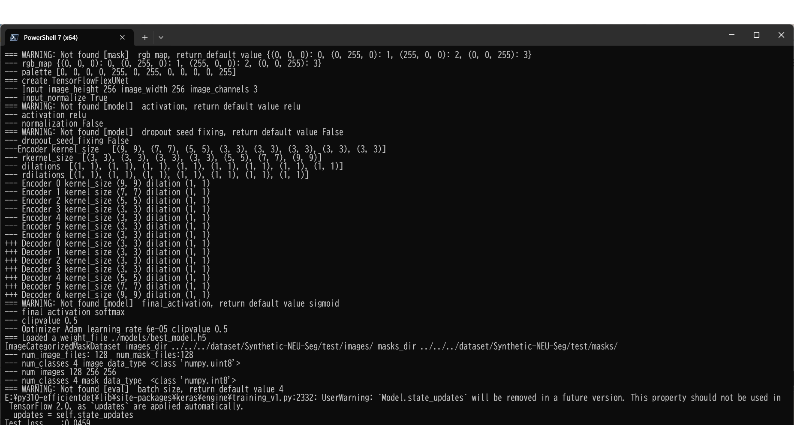
  Image-Segmentation-Synthetic-NEU-Seg

<a href="./projects/TensorFlowFlexUNet/Synthetic-NEU-Seg/evaluation.csv">evaluation.csv</a> 
The loss (categorical_crossentropy) to this Synthetic-NEU-Seg/test was not low, and dice_coef_multiclass not high as shown below.
 
<pre>
categorical_crossentropy,0.0459
dice_coef_multiclass,0.9775
</pre>
 
<h3>5 Inference</h3>
Please move to a <b>./projects/TensorFlowFlexUNet/Synthetic-NEU-Seg</b> folder 
,and run the following bat file to infer segmentation regions for images by the Trained-TensorflowFlexUNet model for Synthetic-NEU-Seg. 
<pre>
>./3.infer.bat
</pre>
This simply runs the following command.
<pre>
>python ../../../src/TensorFlowFlexUNetInferencer.py ./train_eval_infer.config
</pre>

<b>mini_test_images</b> 
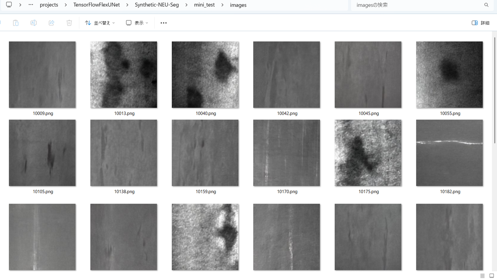 
<b>mini_test_mask(ground_truth)</b> 
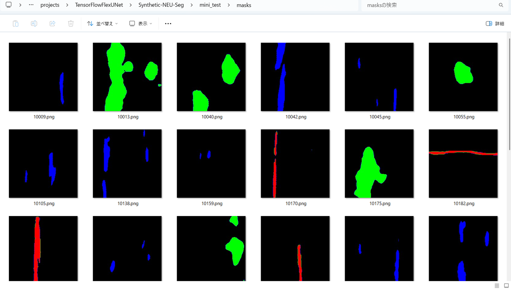 

<b>Inferred test masks</b> 
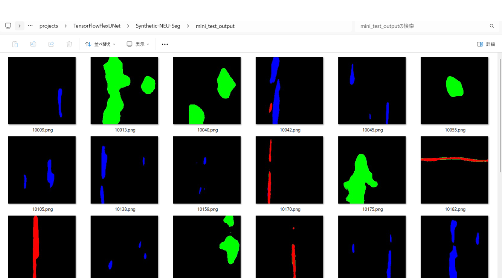 
 

<b>Enlarged images and masks for  Steel-Rail-Surface-Defect Images of 224x224 pixels</b> 
As shown below, the inferred masks predicted by our segmentation model trained by the dataset appear similar to the ground truth masks.
 
<b>rgb_map={Patches:blue, Inclusion:green,  Scratches:red}</b> 

 
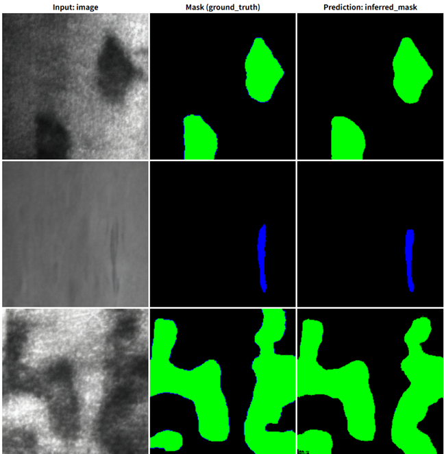 
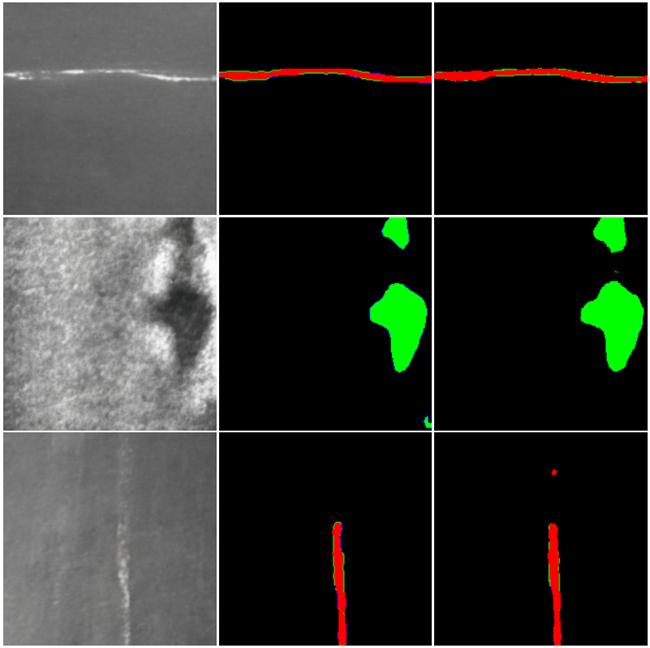 

 
<h3>
References
</h3>
<b>1. Latent Diffusion Models to Enhance the Performance of Visual Defect Segmentation Networks in Steel Surface Inspection</b> 
Jon Leiñena ,  Fátima A Saiz , Iñigo Barandiaran  
<a href="https://pmc.ncbi.nlm.nih.gov/articles/PMC11436218/">
https://pmc.ncbi.nlm.nih.gov/articles/PMC11436218/</a>
 
 
<b>2. Steel surface defect segmentation with SME-DeeplabV3+</b> 
Haiyan Zhang, Zining Zhao, Yilin Liu, Jiange Liu, Tingmei Ma, Kexiao Wu, Zhiwen Zhuang, Jiajun Wang 
<a href="https://journals.plos.org/plosone/article?id=10.1371/journal.pone.0329628">
https://journals.plos.org/plosone/article?id=10.1371/journal.pone.0329628</a>
 
 
<b>3. TensorFlow-FlexUNet-Image-Segmentation-Model</b> 
Toshiyuki Arai  
<a href="https://github.com/sarah-antillia/TensorFlow-FlexUNet-Image-Segmentation-Model">
https://github.com/sarah-antillia/TensorFlow-FlexUNet-Image-Segmentation-Model
</a>
 
 
